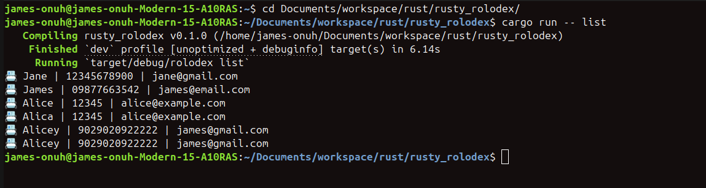
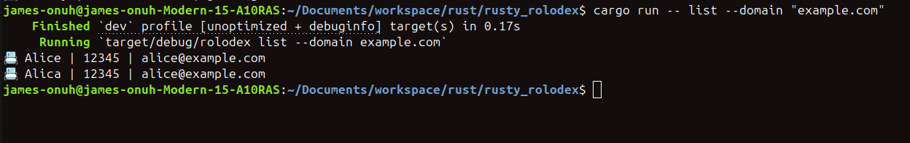
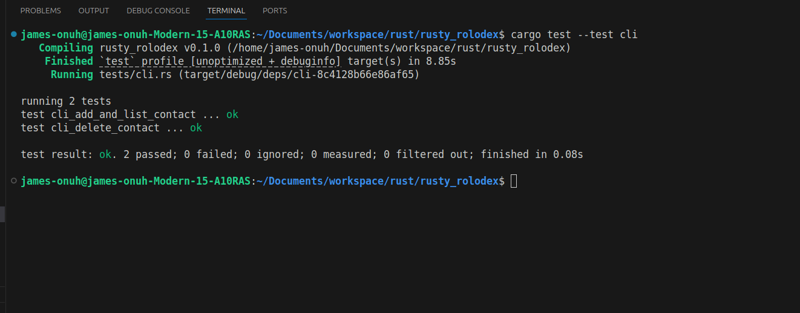
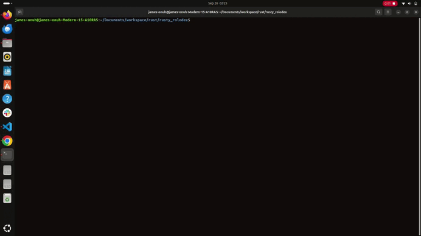

# Walkthrough (Week 2)


The Contact app has been updated to either run on `Memory storage` and `File storage`, with the latter persisted.

By Default, the application runs on the File Storage (`cargo run`).


With the use of .env variable, the runtime store can be changed to `MemStore` by running:.

`STORE_TYPE=mem cargo run`


### MemStore
Contacts added to the `MemStore` are lost after the application is ended or restarted.


Adding Contact


Viewing contact list


After restarting, the Contact list is cleared...


---

### FileStore
`cargo run` lunches the app on the default store (FileStore)


View Contact list...


Let's add a contact to test the persistence:


Resetting the app


---
# Week 4

## Correction from week 3
- ✅️ Pipeline fix
- ✅️ Check for duplicate name before adding contacts
- ✅️ Deleting contact with same name (Going to be concluded)
- ✅️ Updated Phone number validation function name
- ✅️ Contact.txt -> Contact.json Migration
- ✅️ Versioned release via Git tag

## Tasks
Iterator over contact - filter with tags and domain.

In achieving filters by tags or domain, the Contact Struct had to be first updated to accept tags upon creation. In order to support backward compatiblity, the tag field is defined optional so as to support contacts that were created before the feature.

```rust
pub struct Contact {
    pub name: String,
    pub phone: String,
    pub email: String,
    #[serde(default)]
    pub tags: Vec<String>,
}
```

Running the command to return the contact...

```bash
cargo run -- list
```


Running filter by domain
```bash
cargo run -- list --domain "example.com"
```


## Integration test (Black-box testing)
The integration test contains a full run through of the entire app, creating two scenarios for:
- Adding and Listing
- Adding, Deleting and Listing



## Demo

