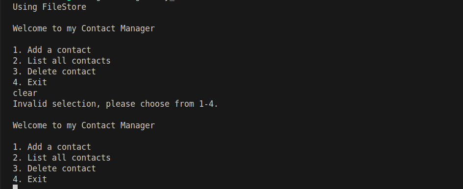
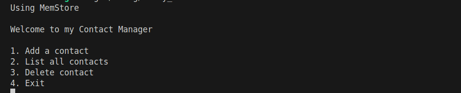
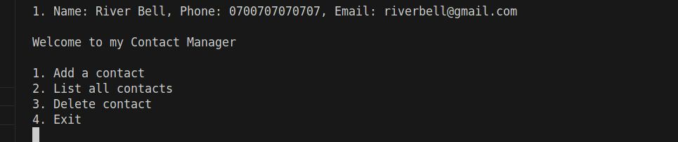
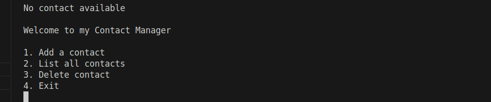
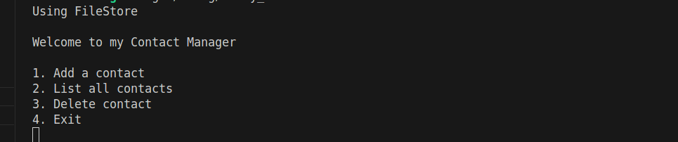
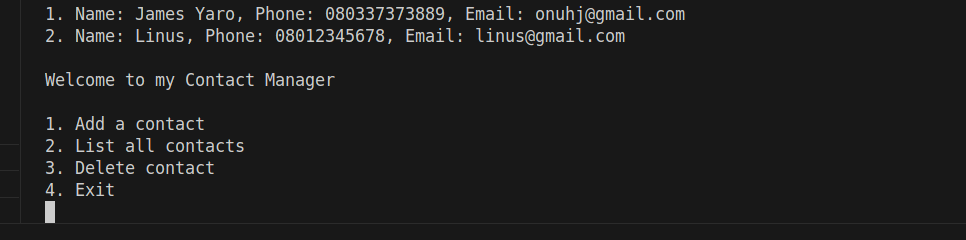
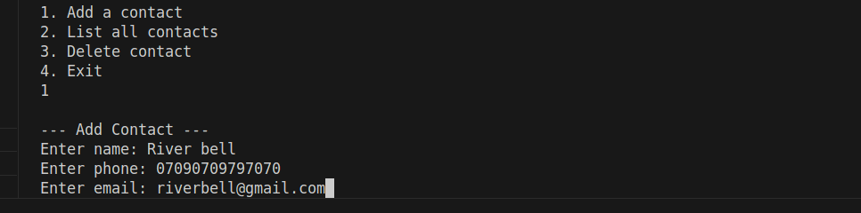
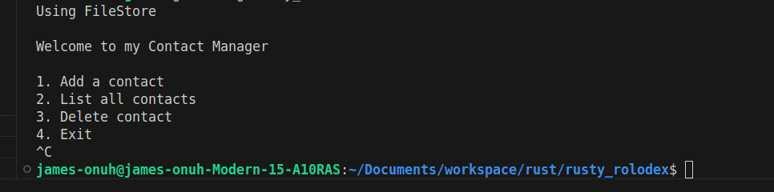

# Walkthrough (Week 2)

The Contact app has been updated to either run on `Memory storage` and `File storage`, with the latter persisted.

By Default, the application runs on the File Storage (`cargo run`).

With the use of .env variable, the runtime store can be changed to `MemStore` by running:.

`STORE_TYPE=mem cargo run`

### MemStore
Contacts added to the `MemStore` are lost after the application is ended or restarted.

Adding Contact

Viewing contact list

After restarting, the Contact list is cleared...

---

### FileStore
`cargo run` lunches the app on the default store (FileStore)

View Contact list...

Let's add a contact to test the persistence:

Resetting the app

---
