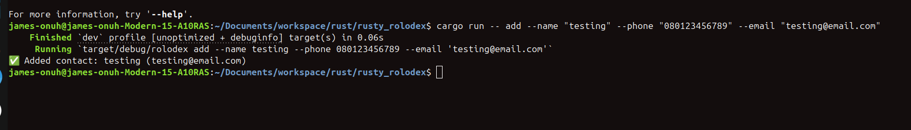
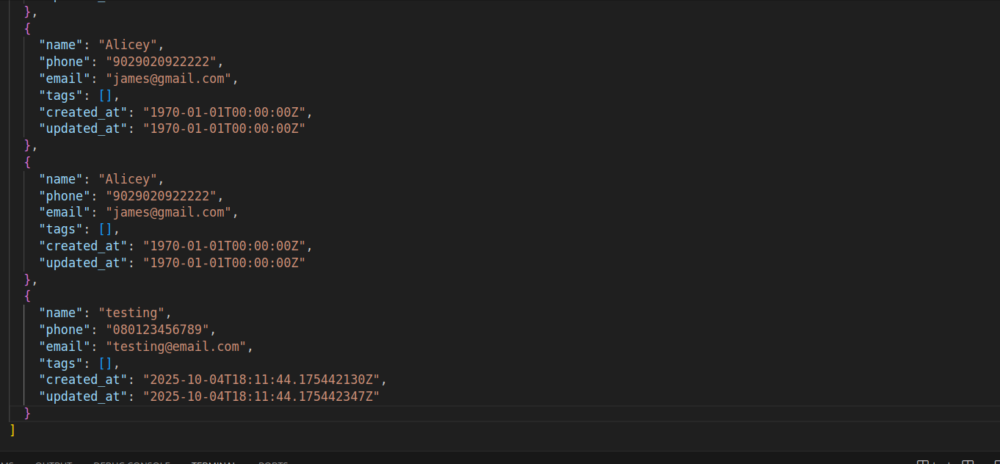
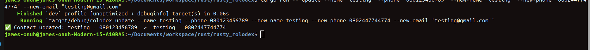

# Week 5

## Tasks
- Add `chrono` timestamps
- Update contact
- Export and Import CSV

### Add `chrono` timestamps
Updated Contact struct with `created_at` and `updated_at` fields.

```rust
pub struct Contact {
    pub name: String,
    pub phone: String,
    pub email: String,
    #[serde(default)]
    pub tags: Vec<String>,
    #[serde(default)]
    pub created_at: DateTime<Utc>,
    #[serde(default)]
    pub updated_at: DateTime<Utc>,
}
```

Adding a contact now automatically adds the `created_at` and `updated_at` fields.



Results


### Update contacts
An `update` command was added to the Cli that handles the updating of contacts.

```bash
cargo run -- update --name <NAME> --phone <PHONE> --new-name <NEW-NAME> --new-phone <NEW-PHONE> --new-email <NEW-EMAIL>
```

Let us update the recent ("testing") contact we added by passing the name and phone number along side a new phone number:

```bash
cargo run -- update --name "testing" --phone "080123456789" --new-name "testing" --new-phone "0802447744774" --new-email "testing@gmail.com"
```


### Export and import CSV